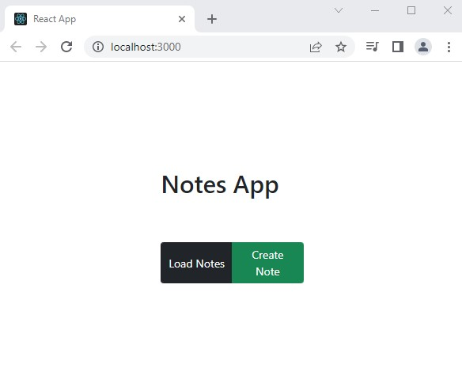
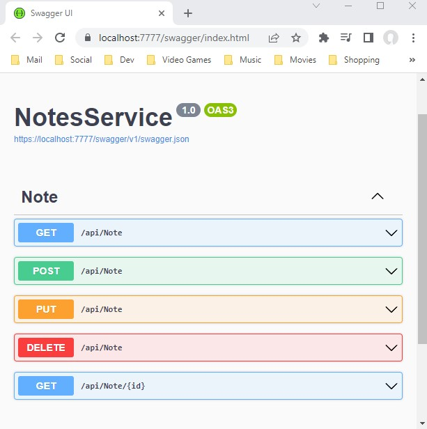

# Notes
---

## Running App + API Together

1. Open "Notes.sln" in Visual Studio 2022
2. Right click Solution and verify both projects are set as startup projects (see screenshot):

3. Select "Start"
4. Both Apps should now start on localhost at the following ports.
     - React App* on localhost:3000
     
     - Notes API on localhost:7777 (Swagger index will be displayed)
     

\*If two browsers start up for React App, either can be used. see **Notes App** Section for more detail.  

### Notes API 
A basic CRUD API using SQLite and Dapper.

### Notes App
A React App that consumes the Notes API. 

**NOTE**: This was my first time building a React App from scratch and there were a few things I was still troubleshooting and would like to come back to and correct. I think they all have to do with my project setup. 

 - Sometimes two instances of the app would Start when running from Visual Studio.

- I  disabled es-lint in `packages.json` as it was throwing an error due to the capitalization of my file paths. Though it does supress the error it sometimes will still show on initial build.

- I would also like to set a custom port so it's not running on the the default port of 3000. I was able to change this in `packages.json` as well but the aforementioned anomlay of two app instances meant one would start on port 3000, another on the custom port. 